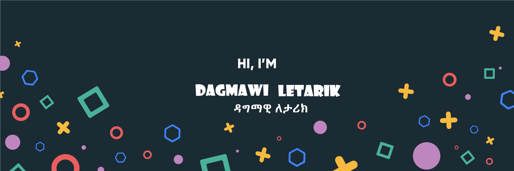

[![AltSchool Badge](https://img.shields.io/badge/-Engineering-6773E5?style=for-the-badge&logo=data:image/png;base64,iVBORw0KGgoAAAANSUhEUgAAAIcAAACHCAYAAAA850oKAAAACXBIWXMAACE4AAAhOAFFljFgAAAAAXNSR0IArs4c6QAAAARnQU1BAACxjwv8YQUAAAcmSURBVHgB7d3/kZtGFAfwbzL5P0oF2VRwlwq8qcBKBUcqsFyBSAW5VGBcgS8ViFRwdgW3qeDcgaM3wBy3egu7sBLY9/3MMD6h5QnBg/0ByAARERERERERERERERERERERERERERERERERERERERERERERERFdwHc4DxtR5uNx+hxRbnOcriOWjS1HC7LH6UvEVETGK5RlzYxyFOl75Fco894r816BVu0cyaHt9Fucnt63aKoCWqncyWFxeir/F03d/483X2sj0IrkTo5CmVd5//bdgFYrd3JoVUrd/qv1HFi1rNgPyEeqCOPNkyrFtX9LYkjV0j9bdFVLjWlk+V3795Xy/g5PCVn11oUuTBqdY91Vq5R5NxK3QLiLahDXbf6CuLEX6slZrQxVKR1WLV+RXMlhoI9OOm9eV7X0sdeyUrmSY6vMex8oWynzpvZaHJpLAH+gScb6OP19nH5p5/enGrSIA+KHruVM8eiVfUS4aikiY/ttnj1ocQanO+9+ZJkK8Q3GAtOvrbAtM0OOasUq896PLFMp86ZWLUOYHDPkGOfQdqqc0t8gjbRb3oKX2FdjbnIY6GeODdKP2rkDYpTZ3GrFIq8taDXmJkfudsI52h000ZxqRaoB681zx+k3xJPu52slZg1a3Jzk0KqAGmkXt/zk6OLWuIyXOHTvcIHte4f5F7dCA2J9BaaPc4xVUw7xF+6+lekdIs1pc7zyXjukZ2ToWotFOq0LXB2nh3bi9ZtEU5NDOx3XmKYKxE9VQ08Q004cEEs0Jzl8Y6OiIdpl/BukkxhvQdlMTQ6/Eekw/cyRs2qpjtPv4B1fWUx94s0o8xym00ZUP7eT9p5DeswuXp/By6NtByIiIiIiIqJvwbl+2ecaT9cyZKxB+tUO/KWdr0rO5LBo7huVf4euY9RohtorXNbBe73EOixBrsKa3mt5frnEhWzaFUi9dPyAy45Q+p9f4mVwWOCSvZDEkGdUCqQz7bK8lL5Sc+8+lzu5jDJf2hWf0LQx0Ja5UspKcn04Tr+CbZFvioFeXUjChNocZWCZEufHaiWxWpmjxLQNXkBvf5wbkyMxOeZUK0aZd4dxFZqbeawXSyY3suw1nveGpCrqnq6fy7bxN72YqVVd92BWF0c4pN947ce0eN42+wj9Jy5WowIm32C8Q7PB+pMZKG+hP8nfP/OMPX4ZOnN07R4t5h5xNm3Zx4F1lPVPaXwbNNt4LKYZieOwQLWyg76yue/V3CNP9ziUHB8w727t6/ZzY9dxj3FbDCdFSkyX+H2ysAjvoAJ5uqh7xG+g/udrCaolRxEZcxdYP4O0ndhNfyFsOyHeUII4LJAc4oDhFZYNJ0embFyLNEUgZo1mx5bt31qZgxJPS477NkbRTjLvIfA9/ITbDJSteuv4gPiEMwMxb9t4twMxrRLTYaHkMEg/ciRZiojY2gYolXI7xG0o//0qEM8EPtu/434P/axllJgl4hKuUsrdQz8Tlog7KBwWSg5hkFbnjm1IUSjlh75UqZS/9cpoSRqiJVzplXlI+D7A+E9xbpC2jcQB4weFw4LJ0ZENOiVJbpRYd0q5oTZM1/10van2yqQkm8FwctjEeN06Pg4so7U1ipGYFuMHhcMKkqNj0SSK7ODYKsd6Me5xegTNNbSzU8trZ5aYBvgB4e9VKjFNREznLXM38n50cpzjv9So0WSvHAk/obluIj8FKZfIXWCZvffa39D/YV20NsBHjPvkvTaBv8VnxA1y+Z97hUzOkRw+WfkKzSlSfh/0T6WMxcu4Opsy4hpbNnUUN9rU4XOD0/qwRtwwdonmyPNHNC3CR9+PWBdth2wwvqOuI+L048X4OSFmkqnJ0Q0X+/NqxJFyb5TlO1KN9L+0wbpoO0B2fI1h/o7sVzNyYNz0XnfXVGoMO1sVPLVaCT0Zn2vo3G9UdRsqRGvp1zifO2XefmQZC/334bW/O68xrMDpNr/DCkij098hHyKWC40s2l4ZC73Pv0mIV3jlcvZWxAFx3fKhdfST5R7jPbmOCcQ0XjmHBbqyBnq3VFbYBpaR+feBZXyHQLnrifFyJ4eF/v33eL6DLPSdqO2kIiKmJNo2IaaLKHMWO+hfRiYZ4zi0KyNnlIeBslsl9jXC4ySPGB5DKZR4uZND3GL4+4fek21hAp97yBzTYaHkECXCKxwz7QZiFxPilYFY50gOUSFt/WQHj4323ifGfEA42RwWTA5RIH3oXMrbiNgmMrZs9O1AnHMlBxB/gNSI73ndZorpMDE5cj7UZPA0dB4apZMejnTfSqT3Jgo0O/8Vnt8mKPGkhV5huI9fea/vMNyyTy1v2nW0eP5Li9K1rNt4NdIYPN3ucOXF7NanHokhSdZvyNeIfJgrZ3L0dfdSbnD6OCQRERERERERERERERERERERERERERERERERERERERERERERERERERERncX/Z96oxRsCt/4AAAAASUVORK5CYII=&logoColor=white&link=https://altschoolafrica.com/schools/engineering)](https://altschoolafrica.com/schools/engineering)  

<!-- START Visitor Count -->

<h2 align="centre">Visitors From MAY 26 2023</h2>  

 
 

<!--

counting of visitors to this page in this section started from MAY 26, 2023

  

 -->	 

    

<!-- END My Github Profile Trophy SECTION -->

I'm a  Computer Scientist,Software Engineer, System Adminstorator, and Full stack Developer who is currently learning and building as a Software Engnnering student at [ALX](https://alxafrica.com). I'm passionate about sharing knowledge, documentation,problem sloving,coding,web engineering, researching and others.

### Glad to see you here! &nbsp;

**Here's a quick summary about me**:

- 😊 Pronouns: He/him
- 💡 Fun fact: I'm currently studying at ALX Africa [School of Software Engineering](https://www.alxethiopia.com/) Class of 2022 Cohort 9.I have many cerification on IT stuff .
- 🌱 I am good in Dart,Flutter,devops,python,C,git and github,fullstack development.
- 😊 I’m looking for help with open source projects,Team Development,freelancer and entry-level opportunities.
- 💼 Current Job: System Administrator In Addis Ababa Water & Sewerage Autority and Develop deferent Platform like mobile apps and websites. 
- 📫 You can [view my resume](#) and contact me by emailing dagmawiletarik@gmail.com.
- 
---

    
  <h2 align="center">My Github Profile Trophy</h2>

<!-- START My Github Profile Trophy SECTION -->

<!-- &layout=compact -->

<!-- START NEW SECTION -->

 <h2 align="center">My Github Stats</h2>

|My github statistics|Most used languages|Streaks|
|-|-|-|
|||

	
	
<!-- START My favorite tools -->
<h2 align="center">🛠️ My favorite tools</h2>

### 👨‍💻 Programming languages

    
    
    
    
    
    
    
    
    
    
    
    
    
    
    
    
    
    
    
    
    
    
    
    
    
    

  
 

### 🧰 Frameworks and libraries

    
    
    
    
    
    
    
    
    
    
    
    
    
    
    
    
    
    
    
    
    
    

 
 
 
### 🗄️ Databases and cloud hosting

    
    
    
    
    
    
    
    
    
    

 
 
 
### 💻 Software and tools

    
    
    
    
    
    
    
    
    
    
    
    
    
    
    
    
    
    
    
    

  

<table align="center">

  <tr>
     <td align="center" width="96">
      
       PHP
    </td>
    <td align="center" width="96">
      
       Python
    </td>
    <td align="center" width="96">
        
       Javascript
    </td>
    <td align="center" width="96">
      
       Laravel
    </td>
    <td align="center" width="96">
      
       Vue JS
    </td>
    <td align="center" width="96">
        
       GraphQL
    </td>
    <td align="center" width="96">
        
       Docker
    </td>
    <td align="center" width="96">
        
       Rest
    </td>
    <td align="center" width="96">
        
       Kubernetes
    </td>
</tr>

<tr>
    <td align="center" width="96">
      
       Git
    </td>
    <td align="center" width="96">
        
       Github
    </td>
    <td align="center"  width="96">
        
       GitLab
    </td>
    <td align="center"  width="96">
        
       HTML
    </td>
    <td align="center" width="96">
        
       CSS
    </td>
    <td align="center"  width="96">
        
       Bootstrap
    </td>
    <td align="center" width="96">
        
       Tailwind
    </td>
    <td align="center" width="96">
        
       PostgreSQL
    </td>
    <td align="center" width="96">
        
       redis
    </td>
</tr>
<tr>
     <td align="center" width="96">
      
       Nuxt JS
    </td>
    <td align="center" width="96">
      
       TypeScript
    </td>
        <td align="center" width="96">
        
       Postman
    </td>
     <td align="center" width="96">
      
       Express
    </td>
            <td align="center" width="96">
        
       MySQL
    </td>
              <td align="center" width="96">
        
       JQuery
    </td>
    <td align="center" width="96">
      
       MySQL
    </td>
     <td align="center" width="96">
        
         Livewire
    </td>
    <td align="center" width="96">
        
         Alpine JS
    </td>
 </tr>
<tr>
     <td align="center" width="96">
      
       Ubuntu
    </td>
     <td align="center" width="96">
      
       Digital Ocean
    </td>
      <td align="center"  width="96">
      
       VS Code
    </td>
     <td align="center"  width="96">
       
       React js
    </td>
      <td align="center" width="96">
       
       Postgress
    </td>
      <td align="center" width="96">
       
       webpack
    </td>
      <td align="center" width="96">
  
        </a> 
       Heroku
    </td>
         <td align="center"  width="96">
     
       Node js
    </td>
    <td align="center" width="96">
  
       Mongo
    </td>
  </tr>

</table>

 

<!-- End My favorite tools -->
 
 
 

<!-- START Contribution Graph SECTION -->

 <h2 align="center">Contribution Graph</h2>
	

 <!--  -->

 
 
	

	
<!-- 

 -->

<!-- END Contribution Graph SECTION -->

---

|  |  |
| ------------- | ------------- |

<!---
dagmawi77/dagmawi77 is a ✨ special ✨ repository because its `README.md` (this file) appears on your GitHub profile.
You can click the Preview link to take a look at your changes.
--->
